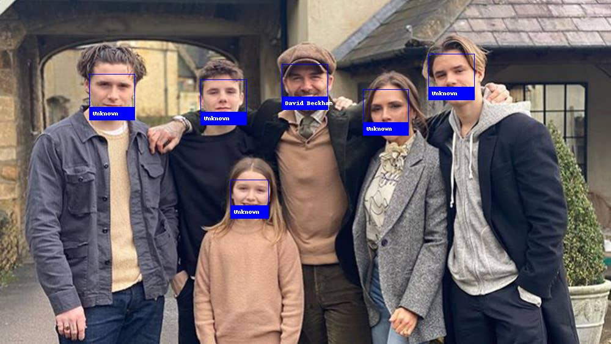

# Recognize a face

This is an example of running David Beckham face recognition on a single image and drawing a box around each person that was identified.

## Deploy 
Click a button to deploy a model with [Syndicai](https://syndicai.co).

## Example

| sample input | sample output |
| --- | --- |
|  |  |

## Reference
Code based on [facial-recognition](https://github.com/ageitgey/face_recognition) framework.
