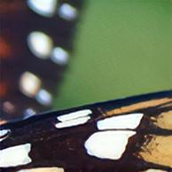

# Super Resolution

Super-scale your images with Residual Dense and Adversarial Networks. 

## Deploy
Click a button to deploy a model with [Syndicai](https://syndicai.co).

## Example
| input | output |
| --- | --- |
|  |  |

## Reference
Code based on the [Idea ISR](https://github.com/idealo/image-super-resolution) implementation.