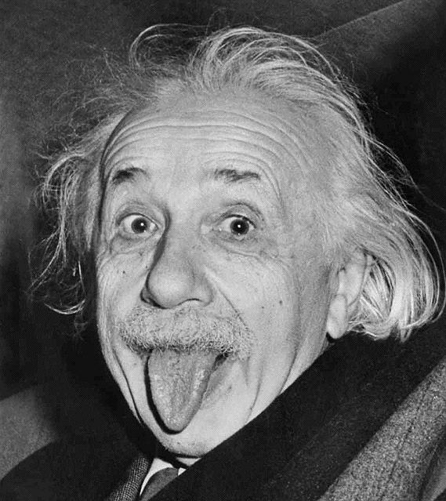

# DeOldify

Colorization and restoration of old images based on NoGAN - A new type of GAN that provides the benefits of GAN training while spending minimal time doing direct GAN training.

## Deploy
Click a button to deploy a model with [Syndicai](https://syndicai.co).

## Example
| input | output |
| --- | --- |
|  |  |

## Reference
Code based on the [Jantic](https://github.com/jantic/DeOldify) implementation.