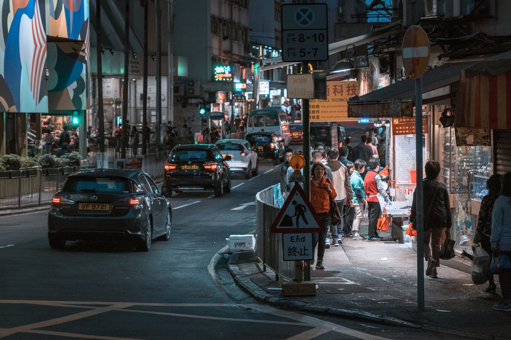
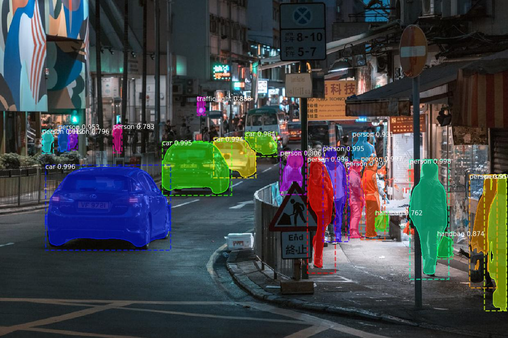

# Object detection and segmentation

This is an implementation of Mask R-CNN on Python 3, Keras, and TensorFlow. The model generates bounding boxes and segmentation masks for each instance of an object in the image. It's based on Feature Pyramid Network (FPN) and a ResNet101 backbone.

## Deploy 
Click a button to deploy a model with [Syndicai](https://syndicai.co).

## Example

| input | output |
| --- | --- |
|  |  |

## Source
Code based on [Mask_RCNN](https://github.com/matterport/Mask_RCNN).
