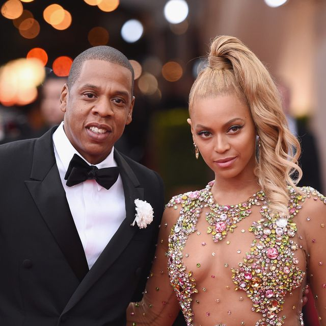

# Blur and anonymize faces

## About
The idea of the algorithm is to anonymize the face by blurring it, thereby making it impossible to identify the face. Such an algorithm could be applied for privacy and identity protection in public/private areas, protecting children online (i.e., blur faces of minors in uploaded photos), photo journalism and news reporting (e.g., blur faces of people who did not sign a waiver form) and many more.

## Deploy
Click a button to deploy a model with [Syndicai](https://syndicai.co).

## Example
| sample input | sample output |
| --- | --- |
|  |  |

## Reference
Code based on [Blur and anonymize faces with OpenCV and Python](https://www.pyimagesearch.com/2020/04/06/blur-and-anonymize-faces-with-opencv-and-python/) by Adrian Rosebrock .

