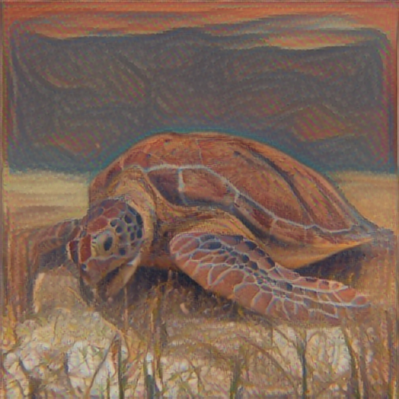

# Style Transfer

Fast arbitrary image style transfer. Performs fast artistic style transfer that may work on arbitrary painting styles

## Deploy 
Click a button to deploy a model with [Syndicai](https://syndicai.co).

## Example
| input | style | output |
| --- | --- | --- |
|  |  |  |

## Reference
Golnaz Ghiasi, Honglak Lee, Manjunath Kudlur, Vincent Dumoulin, Jonathon Shlens. [Exploring the structure of a real-time, arbitrary neural artistic stylization network](https://arxiv.org/abs/1705.06830). Proceedings of the British Machine Vision Conference (BMVC), 2017.