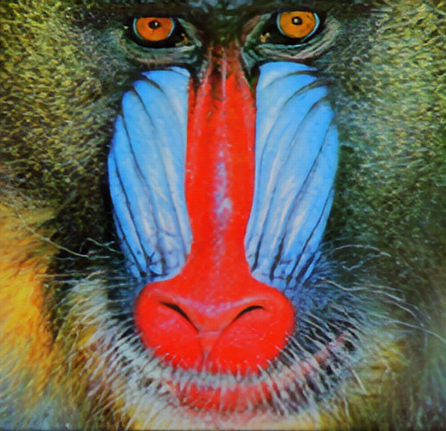

# Super Resolution

Enhanced Super Resolution GAN (Wang et. al.) for image super resolution. Produces x4 Super Resolution Image from images of {Height, Width} >=64.

## Deploy 
Click a button to deploy a model with [Syndicai](https://syndicai.co).

## Example
| input | output |
| --- | --- |
|  |  |

## Reference
Based on [ESRGAN: Enhanced Super-Resolution Generative Adversarial Networks](https://github.com/captain-pool/GSOC/tree/master/E2_ESRGAN) paper.